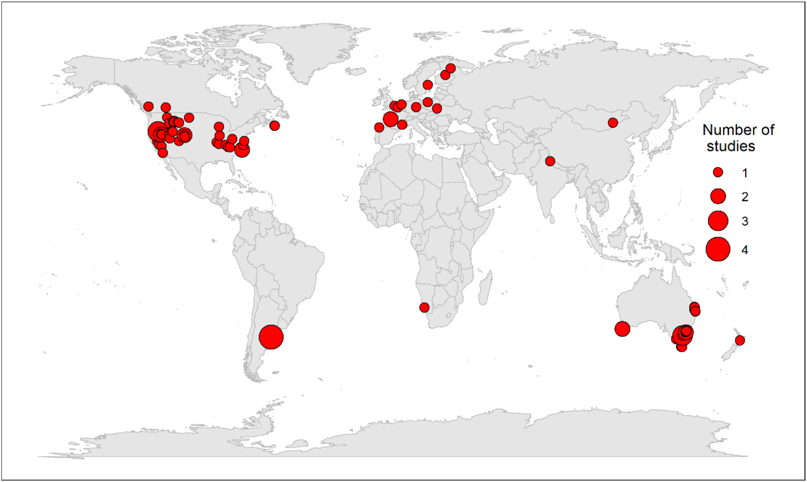

```{r setup, include=FALSE}
knitr::opts_chunk$set(echo = TRUE)
```

#  Feral horse activity reduces environmental quality in ecosystems globally

### **Introduction**

This paper is a meta analysis looking at horse effects on all aspects of an ecosystem and the impacts of horses. 

### **Methods**

This study key words they used to find papers include soil, horse, environment, vegetation, ecolog, crust, hydrolog, and feral. All keywords were searched within five letters of the word to include any endings that might be used. They also searched many different large databases including *Web of Science*, *Scopus*, *Proquest Science & Technology*, and more.

### **Results and Conclusion**

This meta analysis looked at horse populations across five continents and their effects on plants (58% of studies) and soils (35% of studies). Two-thirds of the studies were from North America (47%) and Oceania (21%). 



Three main results were found, low horse activity to no horse activity found that a little horse activity to be neither negative or positive for environmental quality. Further research may even find there to be a significant positive correlation with low horse activity and environmental quality compared to no horse activity. When comparing medium horse activity to high horse activity there was a significant decline (15%) in environmental quality. This result is consistent with other literature 
A significant decline (19%) in ecosystem function associated with feral horse activity was found. This reduction is associated with the capacity to support critical ecosystem functions. The preferred food item of horses is graminoids rather than forbs and shrubs. This preference can lead to the conversion of grasslands to shrublands. 


